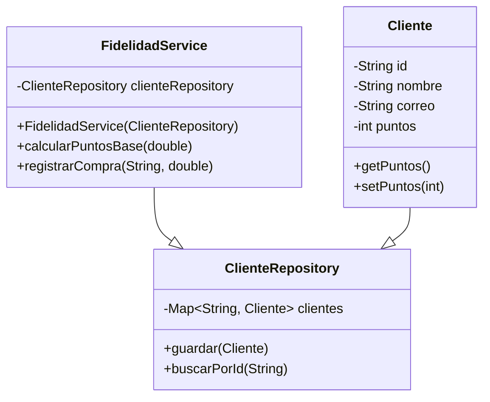

# Proyecto: Tarjeta de Fidelidad Gamificada

Este repositorio contiene el código fuente para un programa de fidelidad gamificado, desarrollado en Java y gestionado con Maven. El proyecto se construye siguiendo un enfoque de Desarrollo Guiado por Pruebas (TDD).

## 1. Desarrollo Guiado por Pruebas (TDD)

El proyecto se construye de manera incremental, donde cada funcionalidad es precedida por una prueba que falla. La siguiente tabla resume los ciclos completados:

| Funcionalidad Implementada | Prueba (Paso Rojo 🔴) | Implementación (Paso Verde 🟢) |
| :--- | :--- | :--- |
| **1. Guardar y Encontrar Cliente** | `alAgregarUnCliente_deberiaPoderEncontrarloPorId()` | Creación de `Cliente` y `ClienteRepository` con métodos `guardar()` y `buscarPorId()`. |
| **2. Validar Email de Cliente** | `alGuardarClienteConCorreoInvalido_deberiaLanzarExcepcion()` | Se añade una validación para el formato del email en el método `guardar()`. |
| **3. Cálculo de Puntos Base** | `testCalcularPuntosBase()` | Creación de `FidelidadService` con el método `calcularPuntosBase()`. |
| **4. Asignar Puntos a Cliente**| `alRegistrarCompra_seDebenSumarPuntosAlCliente()`| Añadir `puntos` a `Cliente`. Inyectar `ClienteRepository` en `FidelidadService`. Crear `registrarCompra()`.|

## 2. Descripción del Diseño

La arquitectura del sistema sigue los principios de Diseño Orientado a Objetos, separando las responsabilidades en distintas capas.

* **Entidades:** Clases simples (POJOs) que modelan los datos del dominio.
* **Repositorios:** Encargados del acceso a datos (actualmente en memoria).
* **Servicios:** Orquestan la lógica de negocio, consumiendo datos de los repositorios.

### Diagrama de Clases (Estado Actual)



## 3. Instrucciones de Compilación y Ejecución

Para compilar y probar el proyecto, necesitas tener instalado Java 21+ y Apache Maven.

### Compilar el Proyecto
```bash
mvn compile
```

### Ejecutar las Pruebas Unitarias
```bash
mvn test
```

## 4. Ejemplo de Salida de Tests

Salida exitosa con 4 pruebas pasando.

```
[INFO] -------------------------------------------------------
[INFO]  T E S T S
[INFO] -------------------------------------------------------
[INFO] Running com.fidelidad.ClienteRepositoryTest
[INFO] Tests run: 2, Failures: 0, Errors: 0, Skipped: 0 ...
[INFO] Running com.fidelidad.FidelidadServiceTest
[INFO] Tests run: 2, Failures: 0, Errors: 0, Skipped: 0 ...
[INFO]
[INFO] Results:
[INFO]
[INFO] Tests run: 4, Failures: 0, Errors: 0, Skipped: 0
[INFO]
[INFO] ------------------------------------------------------------------------
[INFO] BUILD SUCCESS
[INFO] ------------------------------------------------------------------------
```

## 5. Cobertura de Pruebas

#### ¿Qué tipo de cobertura he medido y por qué?

Se mide la **cobertura de código (Code Coverage)**, utilizando la herramienta JaCoCo para asegurar que las pruebas validan la mayor parte posible de la lógica de negocio. Esto es fundamental en un proceso TDD para garantizar la calidad y facilitar el mantenimiento.

## 6. Licencia

Este proyecto está distribuido bajo la licencia MIT.