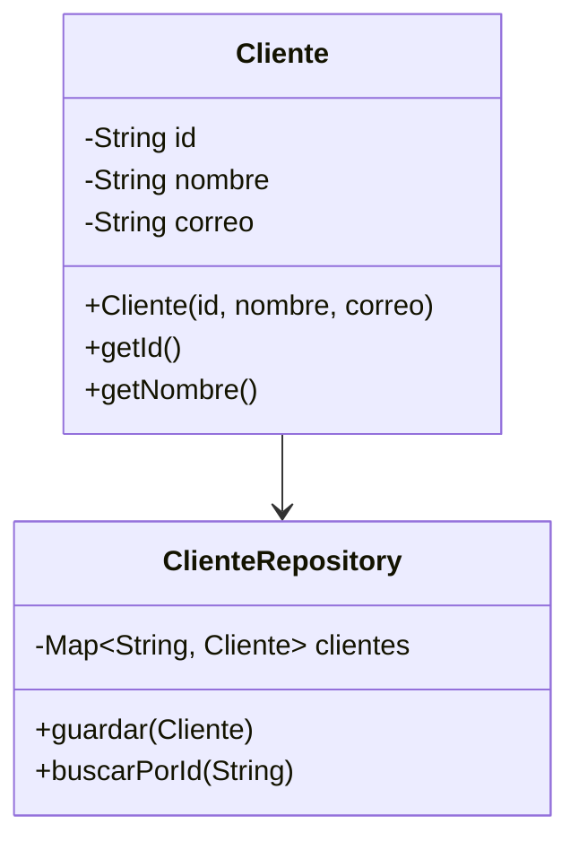

# Proyecto: Tarjeta de Fidelidad Gamificada

Este repositorio contiene el código fuente para un programa de fidelidad gamificado, desarrollado en Java y gestionado con Maven. El proyecto sigue un enfoque de Desarrollo Guiado por Pruebas (TDD) con JUnit 5.

## 1. Descripción del Diseño

La arquitectura del sistema sigue los principios de Diseño Orientado a Objetos, separando las responsabilidades en distintas capas.

* **Entidades:** Clases simples (POJOs) que modelan los datos del dominio, como `Cliente`.
* **Repositorios:** Encargados del acceso a datos (actualmente en memoria) utilizando el patrón Repository. Abstraen la lógica de almacenamiento de la lógica de negocio.

### Diagrama de Clases (Estado Actual)



## 2. Instrucciones de Compilación y Ejecución

Para compilar y probar el proyecto, necesitas tener instalado Java 21+ y Apache Maven.

### Compilar el Proyecto
Desde la raíz del proyecto, ejecuta el siguiente comando para compilar el código fuente:
```bash
mvn compile
```

### Ejecutar las Pruebas Unitarias
Para correr la suite de tests JUnit 5, usa el comando:
```bash
mvn test
```

### Ejecutar la Aplicación Principal (Próximamente)
Una vez que la interfaz de consola (CLI) esté implementada, la aplicación se podrá ejecutar con:
```bash
mvn exec:java -Dexec.mainClass="com.fidelidad.Main"
```

## 3. Ejemplo de Salida de Tests

A continuación se muestra una salida exitosa de la ejecución de pruebas con `mvn test`, validando el `ClienteRepository`.

```
[INFO]
[INFO] -------------------------------------------------------
[INFO]  T E S T S
[INFO] -------------------------------------------------------
[INFO] Running com.fidelidad.ClienteRepositoryTest
[INFO] Tests run: 1, Failures: 0, Errors: 0, Skipped: 0, Time elapsed: 0.061 s -- in com.fidelidad.ClienteRepositoryTest
[INFO]
[INFO] Results:
[INFO]
[INFO] Tests run: 1, Failures: 0, Errors: 0, Skipped: 0
[INFO]
[INFO] ------------------------------------------------------------------------
[INFO] BUILD SUCCESS
[INFO] ------------------------------------------------------------------------
```

## 4. Cobertura de Pruebas

#### ¿Qué tipo de cobertura he medido y por qué?

Se mide la **cobertura de código (Code Coverage)**, utilizando la herramienta JaCoCo (integrada en EclEmma). Específicamente, se analizan métricas como la **cobertura de líneas** y la **cobertura de ramas (branches)**.

**Razón:** Se mide para asegurar cuantitativamente que las pruebas unitarias están ejerciendo la mayor parte posible de la lógica de negocio. En un enfoque TDD, esto es fundamental para:
1.  **Validar el Proceso:** Confirma que cada pieza de código se escribió para satisfacer una prueba.
2.  **Garantizar Calidad:** Una alta cobertura reduce la probabilidad de errores no detectados en producción.
3.  **Facilitar el Mantenimiento:** Proporciona una red de seguridad que permite refactorizar y añadir nuevas funcionalidades con confianza.

## 5. Licencia

Este proyecto está distribuido bajo la licencia MIT. Consulta el archivo `LICENSE` para más detalles.
