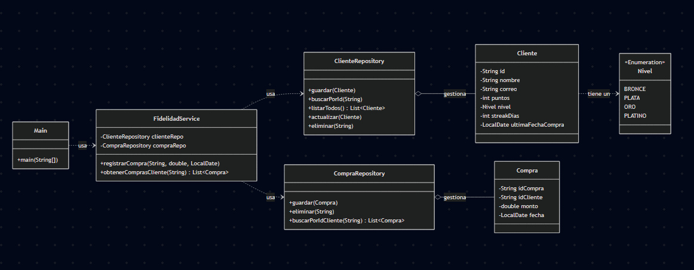
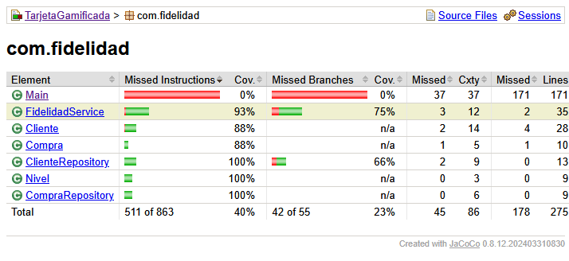

# Proyecto: Tarjeta de Fidelidad Gamificada

Programa de fidelidad gamificado, desarrollado en Java y con Maven. El proyecto se construyó siguiendo un enfoque TDD para Pruebas de Software (INF331)

## 1. Desarrollo Guiado por Pruebas (TDD)

El proyecto se construyó de manera incremental. La siguiente tabla resume los ciclos completados para la lógica de negocio, incluyendo la refactorización para mejorar el código sin alterar su comportamiento.

| Funcionalidad Implementada | Prueba (Paso Rojo 🔴) | Implementación (Paso Verde 🟢) | Refactorización (Paso Azul 🔵) |
| :--- | :--- | :--- | :--- |
| **1. Guardar y Encontrar Cliente**| `alAgregarUnCliente_...` | Creación de `Cliente` y `ClienteRepository`. | No fue necesario. |
| **2. Validar Email de Cliente** | `alGuardarClienteConCorreoInvalido_...` | Añadir validación de email en `guardar()`. | No fue necesario. |
| **3. Cálculo de Puntos Base** | `testCalcularPuntosBase()` | Creación de `FidelidadService`. | No fue necesario. |
| **4. Asignar Puntos a Cliente**| `alRegistrarCompra_...` | Inyectar `ClienteRepository` en `FidelidadService`. | No fue necesario. |
| **5. Actualizar Nivel de Cliente**| `alAcumularSuficientesPuntos_...` | Crear `Nivel` enum. Añadir `nivel` a `Cliente`. | Se completó `actualizarNivel()` para todos los niveles. |
| **6. Aplicar Multiplicador** | `clienteDeNivelSuperiorDebeGanarPuntos...`| Añadir `multiplicador` a `Nivel` y usarlo en el cálculo.| No fue necesario. |
| **7. Bono por Racha de Compras** | `alRealizarTresComprasEnElMismoDia_...`| Añadir `streakDias` y `ultimaFechaCompra` a `Cliente`. | Se extrajo la lógica de la racha a un método privado. |
| **8. CRUD Completo de Clientes**| `alGuardarVariosClientes_...` y otros | Añadir `listarTodos`, `actualizar` y `eliminar`.| No fue necesario. |
| **9. CRUD de Compras** | `alRegistrarCompra_seDebeGuardar...` y otros| Crear `Compra` y `CompraRepository`. | No fue necesario. |
| **10. Interfaz de Consola (CLI)** | N/A | Creación de la clase `Main` con menús interactivos. | N/A (Lógica subyacente ya probada). |

## 2. Descripción del Diseño

La arquitectura del sistema sigue los principios de Diseño Orientado a Objetos, separando las responsabilidades en capas (Entidades, Repositorios, Servicios y UI de Consola). La persistencia de datos es en memoria.

### Diagrama de Clases Final



## 3. Instrucciones de Compilación y Ejecución

Para compilar y probar el proyecto, necesitas tener instalado Java 21+, Apache Maven y estar en la carpeta `TarjetaGamificada`

### Ejecutar las Pruebas Unitarias
El siguiente comando ejecuta la suite completa de tests de JUnit 5.
```bash
mvn test
```

### Ejecutar la Aplicación Principal
Para iniciar el programa en la consola, utiliza el plugin `exec` de Maven:
```bash
mvn exec:java -Dexec.mainClass="com.fidelidad.Main"
```

## 4. Cobertura de Pruebas

### Reporte Visual de Cobertura


### Análisis de la Cobertura

Se mide la **cobertura de código (Code Coverage)**, utilizando la herramienta JaCoCo (la misma que EclEmma usa), esto con el objetivo de cuantificar la efectividad de las pruebas y para validar el proceso TDD que se realizó en los archivos de lógica de negocio. El reporte visual muestra una cobertura muy alta (entre 88% y 100%) para todas las clases que contienen la lógica de negocio (`FidelidadService`, `ClienteRepository`, `CompraRepository`, etc.).

La clase `Main.java`, por otro lado, presenta un 0% de cobertura. Esto se debe a su rol específico en la arquitectura del proyecto:
* La **clase `Main`** actúa como la **capa de Interfaz de Usuario**. Su responsabilidad no es procesar datos ni aplicar reglas, sino únicamente mostrar menús, recibir entradas del usuario y orquestar las llamadas a los métodos del `FidelidadService`.
* Las **pruebas unitarias** se enfocan en validar la **lógica de negocio**. El alto porcentaje de cobertura en las clases de servicio y repositorio demuestra que el núcleo del sistema es robusto y fiable.
* Por lo tanto, el 0% de cobertura es por causa de la separación de responsabilidades. La lógica crítica está probada, y la clase `Main` simplemente utiliza esa funcionalidad ya validada.

## 5. Licencia
Este proyecto está bajo la licencia MIT.